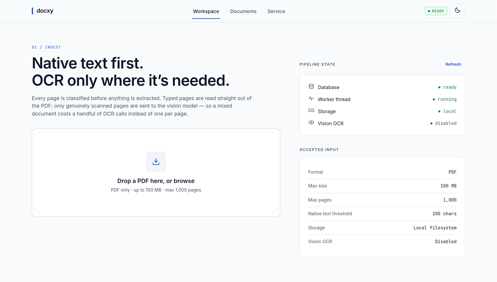
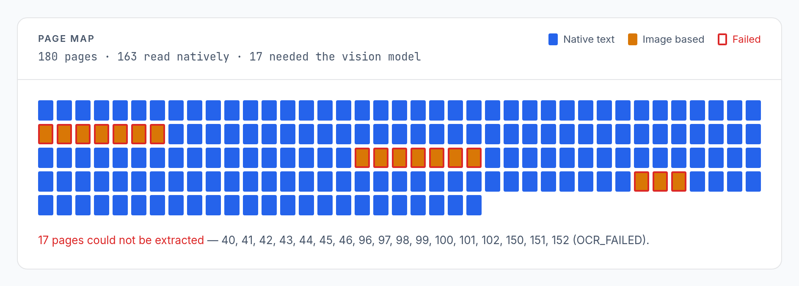
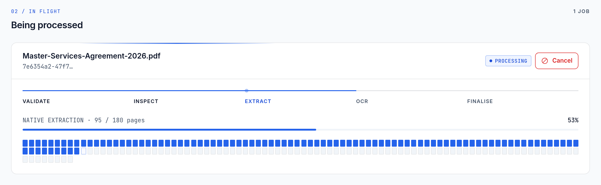
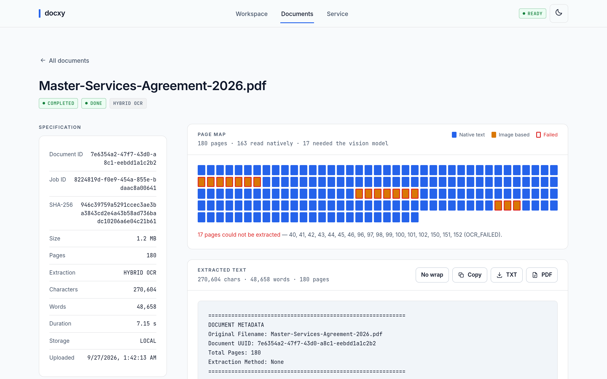
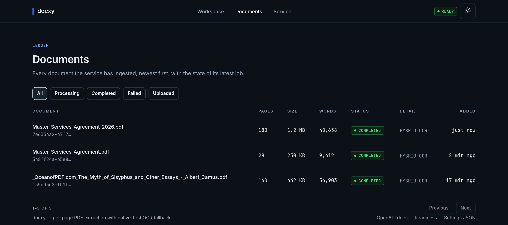

<div align="center">

# docxy

**Per-page PDF text extraction — native first, OCR only where it's needed.**

A self-contained FastAPI service that turns PDFs into text without the usual trade-off:
it reads typed pages straight from the PDF and sends only genuinely scanned pages to a
vision model. No Celery, no Redis, no Postgres — just SQLite and one background thread.

[](https://www.python.org/)
[](https://fastapi.tiangolo.com/)
[](https://www.sqlite.org/)
[](https://pymupdf.readthedocs.io/)

[](Dockerfile)

</div>



---

## The problem

Turning a PDF into text is easy when the PDF is digital and hard when it is a scan.
Most real documents are **both**: a contract with typed clauses and a photographed
signature page, a report with native text and a scanned appendix.

|                              | Cost                          | Result                         |
| ---------------------------- | ----------------------------- | ------------------------------ |
| OCR the whole file           | One vision call **per page**  | Slow and expensive             |
| Native-extract the whole file | Free                          | Silently loses the scanned pages |
| **docxy: classify per page** | Vision calls only where needed | Complete text, minimal cost    |

A 180-page agreement with 17 scanned pages costs **17 vision calls, not 180**.

## How it works

Every page is classified *before* anything is extracted, using character count, text
density and image-area ratio:

| Page type     | Meaning                              | How it is extracted           |
| ------------- | ------------------------------------ | ----------------------------- |
| `NATIVE_TEXT` | Real text layer                      | PyMuPDF — free                |
| `IMAGE_BASED` | Pixels only                          | Rendered to JPEG → vision API |
| `MIXED`       | Text layer **and** heavy imagery     | PyMuPDF, flagged              |
| `EMPTY`       | Neither                              | Skipped                       |

The web UI renders that decision for every page, so the cost profile of a document is
legible at a glance — blue pages were free, amber pages each cost a vision call:



## Features

- **Native-first, per-page pipeline** — only genuinely scanned pages reach the OCR model.
- **Asynchronous by default** — upload returns `202` with a `job_id` immediately; a
  background worker does the work. The HTTP request never waits.
- **Crash-safe** — jobs move through an enforced state machine, write a heartbeat per
  page, and checkpoint per-page status. A killed process does not lose completed work;
  a startup sweep reclaims jobs whose heartbeat went stale.
- **Persistent rate limiting** — per second / minute / hour / day windows plus a minimum
  request gap, stored in SQLite so the vision-API quota is respected across restarts.
- **Deduplication and idempotency** — SHA-256 of the file short-circuits re-uploads, and
  an `Idempotency-Key` header returns the original job instead of creating a second one.
- **Degrades cleanly** — with `AWS_ENABLED=false` files go to the local filesystem; with
  `GROQ_ENABLED=false` image-based pages simply keep whatever native text they had.
  **The defaults run fully offline.**
- **Built-in web UI** — served by the same process, no build step (see below).
- **Uniform API** — every response is `{success, data, error}`, every response carries
  `X-Request-ID` and `X-Response-Time-Ms`.

## Quick start

> Requires Python 3.10 or newer. No database server, message broker or Node toolchain.

```bash
# 1. Clone
git clone https://github.com/harshlaxkar07/docxy.git
cd docxy

# 2. Create a virtualenv and install
python3 -m venv .venv
source .venv/bin/activate          # Windows: .venv\Scripts\activate
pip install -r requirements.txt

# 3. Run — migrations apply automatically on startup
python run.py
```

That's it. No `.env` is required: every setting has a working default.

### Or with Docker

```bash
docker compose up --build
```

The image runs as an unprivileged user and keeps the database, stored PDFs,
extracted text and logs on a single `/data` volume.

| URL                            | What it is                    |
| ------------------------------ | ----------------------------- |
| <http://localhost:8000>        | Web UI                        |
| <http://localhost:8000/docs>   | Swagger / OpenAPI             |
| <http://localhost:8000/redoc>  | ReDoc                         |
| <http://localhost:8000/health/ready> | Readiness probe          |

### Extract your first document

```bash
# Upload — returns immediately with a document_id and job_id
curl -X POST http://localhost:8000/api/v1/documents -F "file=@contract.pdf"

# Poll progress
curl http://localhost:8000/api/v1/jobs/<job_id>

# Fetch the text once the job is DONE
curl http://localhost:8000/api/v1/documents/<document_id>/text
```

To enable OCR for scanned pages, copy `.env.example` to `.env` and set:

```env
GROQ_ENABLED=true
GROQ_API_KEY=your-key-here
GROQ_MODEL=<a current Groq vision model>
```

> **Note:** the shipped `GROQ_MODEL` default (`llama-3.2-11b-vision-preview`) is a
> retired preview model. Point it at a currently supported vision model before
> enabling OCR — see [Limitations](#limitations).

## Security

Authentication is **opt-in** so the service still starts with no configuration.
Turn it on before exposing docxy beyond localhost:

```env
AUTH_ENABLED=true
API_KEYS=a-long-random-key,another-for-rotation
CORS_ALLOW_ORIGINS=https://your-frontend.example.com
```

Every document, job, settings and storage route then requires the key in an
`X-API-Key` header (or an `api_key` query parameter, since a download is a
plain browser navigation and cannot send a header). `/health*` stays open so
liveness and readiness probes keep working.

It **fails closed**: enabling auth without configuring a key rejects every
request rather than silently letting them through. The web UI prompts for a key
on its first 401 and keeps it in that browser only.

CORS credentials are only honoured alongside an explicit origin list —
`*` with credentials is a combination browsers reject outright, so it is
resolved away rather than emitted.

Uploads stream to disk in 1 MB chunks and abort the moment they exceed
`MAX_UPLOAD_SIZE_MB`, so an oversized body is never buffered in memory.

## Web UI

A zero-build interface is served at `/` by the same process. No bundler, no
`package.json`, no `node_modules` — and **no CDN**: the Tailwind utilities are pre-built
into a 3 KB stylesheet and the fonts are self-hosted, so the page makes no external
requests and works entirely offline.

| Route              | View      | What it does                                                        |
| ------------------ | --------- | ------------------------------------------------------------------- |
| `/#/`              | Workspace | Drag-and-drop upload, live service readiness, in-flight job cards    |
| `/#/documents`     | Ledger    | Every document, status filters, pagination                           |
| `/#/doc/<uuid>`    | Detail    | Spec rail, page map, text viewer, TXT/PDF download, job log          |
| `/#/service`       | Service   | Effective configuration and health, read live                        |

Uploading shows the pipeline as it runs — the five phases, a live percentage, and one
cell per page filling in as the worker checkpoints:



<details>
<summary><b>More screenshots</b></summary>

**Document detail** — specification rail, page map, extracted text and job log:



**Document ledger, dark theme** — the UI follows your system theme and can be toggled:



</details>

**How it stays cheap.** The UI holds no job state of its own. It polls
`GET /api/v1/documents`, which joins each document with its latest job — so progress for
*N* in-flight documents costs one request, not *N*. The interval adapts (1.2 s while work
is running, 12 s when idle) and pauses entirely in a hidden tab. Because all state lives
server-side, refreshing mid-job loses nothing.

Accessibility is verified at **0 axe-core WCAG 2.1 AA violations** across all four views
in both themes.

## Architecture

```
                     HTTP client (curl / your app / the web UI)
                                     │
                                     ▼
          ┌────────────────────────────────────────────────────┐
          │  FastAPI  (app/main.py)                            │
          │  correlation-ID middleware → X-Request-ID          │
          │  3 exception handlers → uniform error envelope     │
          │  routers: health · documents · jobs · settings     │
          │  StaticFiles("/") → web UI (mounted last)          │
          └───────────────┬────────────────────────────────────┘
                          │ POST /api/v1/documents (multipart)
                          ▼
          ┌────────────────────────────────────────────────────┐
          │  DocumentService.process_upload                    │
          │  1. size / extension / %PDF- magic bytes           │
          │  2. PyMuPDF structural check (encrypted, pages)    │
          │  3. SHA-256 duplicate?  Idempotency-Key match?     │
          │  4. write original to storage                      │
          │  5. BEGIN IMMEDIATE: insert document + job, COMMIT │
          └───────────────┬────────────────────────────────────┘
                          │ 202 Accepted {document_id, job_id}
                          ▼                        ┌──────────────┐
                   (returns at once)               │  SQLite WAL  │
                                                   │   9 tables   │
          ┌────────────────────────────────────┐   │ data/app.db  │
          │ BackgroundWorker daemon thread     │◄─►└──────────────┘
          │  startup: recover_stale_jobs()     │          ▲
          │  loop: claim_next_job() every 2s   │          │
          │    BEGIN IMMEDIATE + guarded       │          │
          │    UPDATE … WHERE status IN        │          │
          │    ('QUEUED','RETRYING')           │          │
          └───────────────┬────────────────────┘          │
                          ▼                               │
          ┌────────────────────────────────────────────┐  │
          │ TaskProcessor.process_job                  │──┘
          │  temp dir ─ fetch original ─ re-validate   │
          │  init document_pages rows                  │
          │  for each page:                            │
          │    classify ─► NATIVE_TEXT / MIXED ─► PyMuPDF
          │            └─► IMAGE_BASED ─► 150dpi JPEG ─┐
          │    heartbeat + progress per page           ││
          │  aggregate TXT ─ extracted_text ─ output_files
          │  job → DONE / FAILED + job_logs entry      ││
          └───────────────┬────────────────────────────┘│
                          ▼                             ▼
              ┌────────────────────┐   ┌──────────────────────┐
              │ Storage            │   │ Vision OCR provider  │
              │ S3 (boto3) or      │   │ via RateLimiter      │
              │ local ./data/output│   │ (SQLite-backed) +    │
              │ documents/YYYY/MM/ │   │ retry w/ backoff     │
              │ extracted/YYYY/MM/ │   │ logged to api_usage  │
              └────────────────────┘   └──────────────────────┘
                                         (disabled by default)
```

**Request lifecycle**

1. `POST /api/v1/documents` validates size → extension → `%PDF-` header → PyMuPDF
   structure (rejecting encrypted, zero-page or oversized files).
2. The SHA-256 is matched against `documents.file_hash`; a completed match returns the
   prior job with `is_duplicate: true`. An `Idempotency-Key` is matched the same way.
3. The document and job rows are inserted in one `BEGIN IMMEDIATE` transaction, so a
   failure never leaves an orphan job. The route returns `202`.
4. The worker polls, then claims a job with a guarded
   `UPDATE … WHERE id = ? AND status IN ('QUEUED','RETRYING')` — `rowcount == 0` means
   another worker won the race.
5. `TaskProcessor` runs the pipeline in a temp dir, bumping `last_heartbeat_at` and
   `processed_pages` as each page completes.
6. On startup, `RecoveryService.recover_stale_jobs()` resets jobs whose heartbeat is
   older than `JOB_STALE_TIMEOUT_SECONDS` to `RETRYING`, or `FAILED` past
   `JOB_MAX_ATTEMPTS`.

## API

All endpoints return `{success, data, error}`. Full reference: [`docs/api.md`](docs/api.md).

| Method | Endpoint                               | Purpose                                    |
| ------ | -------------------------------------- | ------------------------------------------ |
| `POST` | `/api/v1/documents`                    | Upload a PDF → `202` with `document_id` + `job_id` |
| `GET`  | `/api/v1/documents`                    | List documents, each joined with its latest job |
| `GET`  | `/api/v1/documents/{id}`               | Document metadata                          |
| `GET`  | `/api/v1/documents/{id}/text`          | Aggregated extracted text                  |
| `GET`  | `/api/v1/documents/{id}/pages`         | Per-page classification + native/OCR summary |
| `GET`  | `/api/v1/documents/{id}/download`      | Original PDF or generated TXT              |
| `GET`  | `/api/v1/jobs/{id}`                    | Status, stage, progress, page counts       |
| `GET`  | `/api/v1/jobs/{id}/logs`               | Job lifecycle log                          |
| `POST` | `/api/v1/jobs/{id}/retry`              | Retry a failed job                         |
| `POST` | `/api/v1/jobs/{id}/cancel`             | Cancel an active job                       |
| `GET`  | `/api/v1/settings`                     | Effective non-secret configuration         |
| `GET`  | `/api/v1/settings/runtime`             | Tunable settings and their override state  |
| `PUT`  | `/api/v1/settings/runtime/{key}`       | Override a tunable setting, no restart     |
| `DELETE` | `/api/v1/settings/runtime/{key}`     | Clear an override                          |
| `GET`  | `/api/v1/storage/local/{key}`          | Serve a stored object when AWS is disabled |
| `GET`  | `/health` · `/health/live` · `/health/ready` | Liveness and readiness              |

**Error envelope**

```json
{
  "success": false,
  "data": null,
  "error": {
    "code": "INVALID_PDF_FORMAT",
    "message": "File does not start with valid PDF binary signature (%PDF-)",
    "request_id": "req_a1b2c3d4e5",
    "details": null
  }
}
```

## Configuration

Settings are read from environment variables or a `.env` file by `app/core/config.py`.
**Every variable has a working default — none is required to start the service.**

The ones you are most likely to touch:

| Variable                 | Default              | Purpose                                     |
| ------------------------ | -------------------- | ------------------------------------------- |
| `PORT`                   | `8000`               | Bind port                                   |
| `MAX_UPLOAD_SIZE_MB`     | `100`                | Upload size limit                           |
| `MAX_PAGES_PER_DOCUMENT` | `1000`               | Rejects larger PDFs at validation           |
| `GROQ_ENABLED`           | `false`              | Turns on the vision OCR fallback            |
| `GROQ_API_KEY`           | *(empty)*            | Required when OCR is enabled                |
| `AWS_ENABLED`            | `false`              | Switches storage from local disk to S3      |
| `WORKER_ENABLED`         | `true`               | Starts the background worker thread         |

<details>
<summary><b>All settings</b></summary>

### Application

| Variable | Default | Purpose |
| --- | --- | --- |
| `APP_NAME` | `PDF Extraction Service` | Title shown in `/docs` and `/health` |
| `APP_ENV` | `development` | Environment label |
| `DEBUG` | `false` | Enables uvicorn reload via `run.py` |
| `HOST` / `PORT` | `0.0.0.0` / `8000` | Bind address |
| `DATABASE_PATH` | `./data/app.db` | SQLite file location |

### Validation and page classification

| Variable | Default | Purpose |
| --- | --- | --- |
| `MAX_UPLOAD_SIZE_MB` | `100` | Upload size limit (checked after the body is in RAM) |
| `MAX_PAGES_PER_DOCUMENT` | `1000` | Rejects larger PDFs at validation |
| `PDF_MIN_TEXT_LENGTH` | `200` | Chars at/above which a page counts as text-bearing |
| `PDF_MIN_TEXT_DENSITY` | `0.005` | Chars per unit page area threshold |
| `PDF_MIN_IMAGE_AREA_RATIO` | `0.35` | Image coverage at/above which a text page becomes `MIXED` |

### Storage

| Variable | Default | Purpose |
| --- | --- | --- |
| `AWS_ENABLED` | `false` | Switches storage from local filesystem to S3 |
| `AWS_REGION` | `us-east-1` | S3 region |
| `AWS_ACCESS_KEY_ID` | *(empty)* | Omit to use the ambient boto3 credential chain |
| `AWS_SECRET_ACCESS_KEY` | *(empty)* | S3 credential |
| `AWS_S3_BUCKET` | `pdf-processing-bucket` | Target bucket |
| `S3_PRESIGNED_EXPIRATION_SECONDS` | `3600` | Presigned URL lifetime |
| `LOCAL_STORAGE_DIR` | `./data/output` | Storage root when AWS is off |

### Vision OCR

| Variable | Default | Purpose |
| --- | --- | --- |
| `GROQ_ENABLED` | `false` | Enables the vision OCR fallback |
| `GROQ_API_KEY` | *(empty)* | Required when OCR is enabled |
| `GROQ_MODEL` | `llama-3.2-11b-vision-preview` | Vision model id — **retired; see Limitations** |
| `GROQ_REQUESTS_PER_SECOND` | `1` | Rate-limit window |
| `GROQ_REQUESTS_PER_MINUTE` | `20` | Rate-limit window |
| `GROQ_REQUESTS_PER_HOUR` | `500` | Rate-limit window |
| `GROQ_REQUESTS_PER_DAY` | `1000` | Rate-limit window |
| `GROQ_MIN_REQUEST_GAP_SECONDS` | `2` | Enforced minimum spacing between calls |
| `GROQ_MAX_RETRIES` | `3` | Retries for rate-limit/timeout errors only |
| `GROQ_TIMEOUT_SECONDS` | `30.0` | Per-call timeout |

### Worker and recovery

| Variable | Default | Purpose |
| --- | --- | --- |
| `WORKER_ENABLED` | `true` | Starts the background thread from the lifespan |
| `WORKER_COUNT` | `1` | Read but **not honored** — exactly one worker starts |
| `WORKER_POLL_INTERVAL_SECONDS` | `2` | Idle poll delay |
| `WORKER_HEARTBEAT_INTERVAL_SECONDS` | `10` | Declared; no timer thread uses it |
| `JOB_STALE_TIMEOUT_SECONDS` | `120` | Heartbeat age after which recovery reclaims a job |
| `JOB_MAX_ATTEMPTS` | `3` | Attempts before a recovered job fails permanently |

### Output and logging

| Variable | Default | Purpose |
| --- | --- | --- |
| `TXT_INCLUDE_PAGE_MARKERS` | `true` | Writes `==== PAGE n ====` separators into the TXT |
| `TXT_INCLUDE_METADATA` | `true` | Writes a metadata header block into the TXT |
| `LOG_LEVEL` | `INFO` | Log level (also passed to uvicorn) |
| `LOG_TO_DATABASE` | `true` | Mirrors job events into `job_logs` |
| `LOG_DIR` | `./logs` | Rotating log destination |

</details>

Logs are secret-masked: `gsk_*`, `AKIA*`, bearer tokens and `api_key=…` are redacted
before anything reaches disk.

## Runtime configuration

Most settings are read once at startup, but an allowlisted set can be retuned
without a restart. Overrides live in the `settings` table and take precedence
over the environment:

```bash
# Raise the native-text threshold on a running service
curl -X PUT http://localhost:8000/api/v1/settings/runtime/PDF_MIN_TEXT_LENGTH \
  -H 'Content-Type: application/json' -d '{"value": 350}'

# Inspect every tunable value and whether it is overridden
curl http://localhost:8000/api/v1/settings/runtime

# Drop the override; the environment value applies again
curl -X DELETE http://localhost:8000/api/v1/settings/runtime/PDF_MIN_TEXT_LENGTH
```

Tunable keys: the three classification thresholds, `TXT_INCLUDE_PAGE_MARKERS`,
`TXT_INCLUDE_METADATA`, `GROQ_ENABLED`, `GROQ_MODEL`,
`WORKER_POLL_INTERVAL_SECONDS` and `JOB_STALE_TIMEOUT_SECONDS`. Anything
outside that allowlist is rejected, so a settings write cannot redefine paths
or credentials.

## Data model

SQLite via the standard library, opened with `journal_mode=WAL`, `foreign_keys=ON`,
`synchronous=NORMAL` and a 5 s busy timeout. Migrations are one idempotent
`CREATE TABLE IF NOT EXISTS` script run from the FastAPI lifespan on every start — there
is no versioned migration history.

| Table              | Holds                                                                  |
| ------------------ | ---------------------------------------------------------------------- |
| `documents`        | UUID, filenames, size, indexed SHA-256, page count, status, timings     |
| `jobs`             | Status, stage, attempts, `worker_id`, heartbeat, progress, idempotency key |
| `document_pages`   | Per-page metrics, `page_type`, `extraction_method`, `ocr_used`, status  |
| `extracted_text`   | The aggregated text, char/word counts, `text_hash`                      |
| `output_files`     | One row per artifact (`ORIGINAL_PDF`, `EXTRACTED_TXT`) with its real key |
| `job_logs`         | Structured lifecycle events per job                                     |
| `api_usage`        | Every vision call: model, status, latency, tokens                       |
| `rate_limit_state` | Persistent counters per provider/window                                 |
| `settings`         | Created but not yet used by any code                                    |

Files are stored under date-partitioned keys —
`documents/YYYY/MM/<uuid>/original.pdf` and `extracted/YYYY/MM/<uuid>/extracted.txt` —
identically on S3 and on local disk.

## Project structure

```
docxy/
├── run.py                     # uvicorn entry point
├── Dockerfile                 # multi-stage; runs unprivileged on /data
├── docker-compose.yml
├── pyproject.toml             # metadata, deps, pytest config
├── requirements.txt           # runtime deps (pinned to a major range)
├── requirements-dev.txt       # + pytest, moto
├── tailwind.config.js         # recipe for regenerating the UI stylesheet
├── .env.example               # every setting with its default; credentials blank
├── app/
│   ├── main.py                # FastAPI app, lifespan, middleware, error handlers
│   ├── api/routes/            # documents · jobs · health · settings · storage
│   ├── core/                  # config, logging, exceptions, security, runtime settings
│   ├── constants/             # status enums, error codes, state machine
│   ├── db/                    # connection, migrations, repositories
│   ├── schemas/               # pydantic request/response models
│   ├── services/              # document, pdf, extraction, txt, s3, groq, rate limiter
│   ├── workers/               # background worker + task processor
│   ├── utils/                 # hashing, file helpers
│   └── static/                # web UI — no build step required
│       ├── index.html
│       ├── css/               # docxy.css (tokens) · tailwind.css (built) · fonts.css
│       ├── fonts/             # self-hosted Inter + JetBrains Mono
│       └── js/                # api.js · ui.js · app.js
├── tests/                     # unit · integration · performance
├── .github/workflows/ci.yml   # tests on 3.10-3.12 + Docker build
├── docs/                      # architecture, api, pipeline, recovery, worker, …
└── design-system/             # generated UI design system reference
```

## Testing

```bash
pip install -r requirements-dev.txt

# Unit + integration (50 tests)
pytest -q

# Include the performance benchmark (asserts < 100 ms per page)
pytest tests/performance -q
```

Covered: upload validation and the streaming size cutoff, SHA-256 dedup,
idempotency, page classification, the job state machine, atomic claiming, the
persistent rate limiter, crash recovery *including the content of a resumed
job's output*, API key auth, artifact downloads across a month boundary, the
vision OCR fallback via an injected fake provider, and S3 mode against a mocked
bucket (`moto`). A full upload → worker → extraction → TXT → download run ties
it together.

CI runs the suite on Python 3.10, 3.11 and 3.12, then builds the Docker image
and waits for the container to report ready.

## Developing the web UI

The UI is plain ES modules plus CSS — edit and reload, no build. The only generated
asset is the Tailwind utility stylesheet, needed **only if you add new utility classes**:

```bash
npx tailwindcss@3.4.17 -c tailwind.config.js \
  -i app/static/css/tailwind.src.css -o app/static/css/tailwind.css --minify
```

The generated file is committed, so running docxy never requires Node.

## Documentation

| Document | Covers |
| --- | --- |
| [`docs/architecture.md`](docs/architecture.md) | System design and module layout |
| [`docs/api.md`](docs/api.md) | Full endpoint reference |
| [`docs/processing-pipeline.md`](docs/processing-pipeline.md) | Classification and extraction |
| [`docs/worker.md`](docs/worker.md) | Background worker and job claiming |
| [`docs/recovery.md`](docs/recovery.md) | Crash recovery and heartbeats |
| [`docs/rate-limiting.md`](docs/rate-limiting.md) | Persistent multi-window limiter |
| [`docs/database.md`](docs/database.md) | Schema reference |
| [`docs/configuration.md`](docs/configuration.md) | Settings reference |

## License

Released under the terms chosen by the repository owner.
